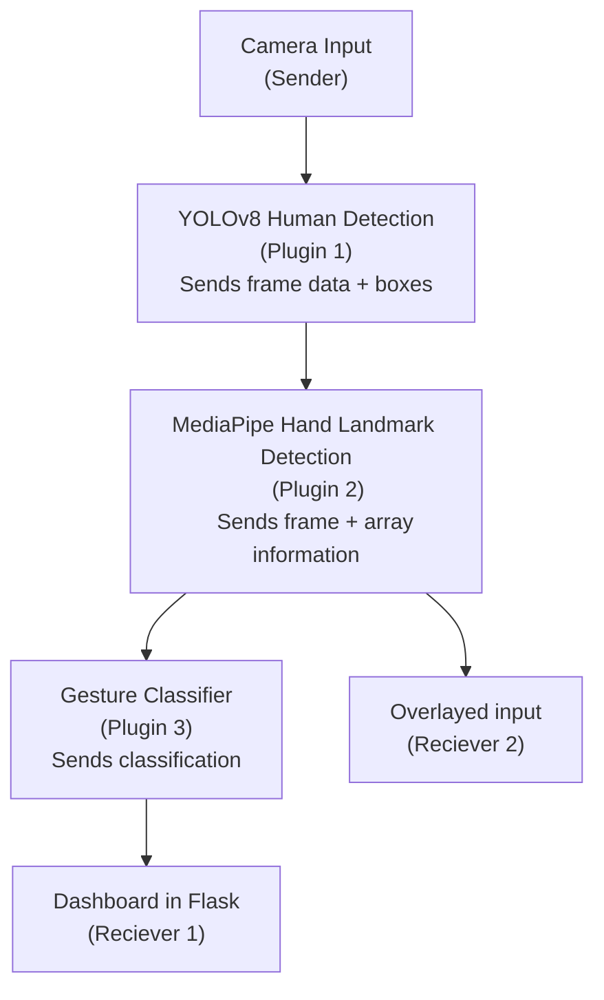

# HSRN Corelink Plugin POC

This project provides a **proof-of-concept (PoC)** for plugin integration within [hsrn.nyu.edu](https://hsrn.nyu.edu), featuring real-time human detection and hand gesture recognition using YOLOv8 and MediaPipe. It is intended to prove that we can run our idea of a plugin, where we can containerize features and tools in typical experimental pipeleins and deploy them smartly to a cluster and manage them with a centralized server

---

## Installation

``` bash
    conda create -f env.yaml
```

Alternative via pip

``` bash
    pip install -r requirements.txt
```

| We have determined that this codebase will operate on 3.10.16 but currently the mediapipe from google is too unstable for >= v3.11.

## Plugin PoC Workflow



### How the classifier works:

Manual classifer:

Relies on the 21 landmarks generated by mediapipe